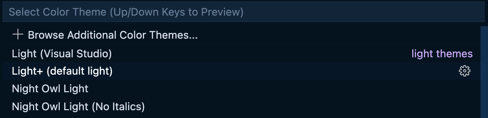

<link rel="preconnect" href="https://fonts.googleapis.com">
<link rel="preconnect" href="https://fonts.gstatic.com" crossorigin>
<link href="https://fonts.googleapis.com/css2?family=Noto+Sans+JP:wght@400;700&family=Noto+Serif+JP:wght@400;700&display=swap" rel="stylesheet">

# VS Code Setup for New Programmars
Author: [CLRT19](index.html)
Coauthor: [Github Copilot](https://github.com/features/copilot)
## Introduction
When one first started to learn programming, it is often a good idea to use a web-based Jupyter Notebook to write code and run it. However, as one's programming skill grows, it is often a good idea to switch to a more powerful IDE (Integrated Development Environment) such as VS Code. **It is a lot easier to debug in the jupyter note book in VScode**, because you get all the highlights and auto completion. In this tutorial, we will show you how to install VS Code and how to use it to write code in Python.

## Installing VS Code

To install VS Code, go to [https://code.visualstudio.com/](https://code.visualstudio.com/) and download the installer for your operating system. After the installation is complete, you should be able to launch VS Code from the Start menu.

## Installing Python Extension

VS Code is a general-purpose IDE, and it does not come with any programming language support. To use it to write code in Python, we need to install the Python extension. To do this, open VS Code and click on the Extensions icon on the left sidebar. Then search for "Python" and install the extension.

## Installing Jupyter Extension

Similarly to the Python extension, we also need to install the Jupyter extension to use VS Code as a Jupyter Notebook. To do this, open VS Code and click on the Extensions icon on the left sidebar. Then search for "Jupyter" and install the extension by Microsoft.

## Creating a New Jupyter Notebook

To create a new Jupyter Notebook, click on the File icon on the left sidebar and select "New File". Then, click on the "Jupyter Notebook" icon on the top right corner of the window. This will create a new Jupyter Notebook file. You can then write code in the notebook and run it. 

You can choose the kernel that you want to use to run the code. To do this, click on the "Select Kernel" button on the top right corner of the window. Then, select the kernel that you want to use.

For me is the base conda environment that has jupyter packages, so I select the Python 3 (ipykernel) kernel.

## Github Copilot 

This is a great feature that is built into VS Code. It is a code completion tool that can help you write code. It is powered by machine learning, and it can help you write code faster. To use it, you need to install the Github Copilot extension. To do this, open VS Code and click on the Extensions icon on the left sidebar. Then search for "Github Copilot" and install the extension by Github. **In fact, the above thing you just read is generated by Github Copilot.** However in order to use it you need to have a github pro account. You can get free github pro if you are a college student. Check the below website for more details. [https://education.github.com/discount_requests/application](https://education.github.com/discount_requests/application)

## Customize your VS Code

You can customize your VS Code to make it look better. Type commadn + shift + p to open the command palette. Then type **Theme** and select **"Preferences: Color Theme"**. Then select the theme that you want to use. You can also browse through additional themes by clicking on the "Browse additional themes" button. I personally like the dark "Night Owl" theme.

